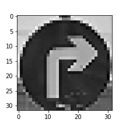

#**Traffic Sign Recognition**

## Writeup

---

**Build a Traffic Sign Recognition Project**

The goals / steps of this project are the following:
* Load the data set (see below for links to the project data set)
* Explore, summarize and visualize the data set
* Design, train and test a model architecture
* Use the model to make predictions on new images
* Analyze the softmax probabilities of the new images
* Summarize the results with a written report

## Rubric Points
### Here I will consider the [rubric points](https://review.udacity.com/#!/rubrics/481/view) individually and describe how I addressed each point in my implementation.

---
### Writeup / README

#### 1. Provide a Writeup / README that includes all the rubric points and how you addressed each one. You can submit your writeup as markdown or pdf. You can use this template as a guide for writing the report. The submission includes the project code.

You're reading it! and here is a link to my [project code](https://github.com/skoocda/CarND-Traffic-Sign-Classifier-Project/blob/master/Traffic_Sign_Classifier.ipynb)

### Data Set Summary & Exploration

#### 1. Provide a basic summary of the data set and identify where in your code the summary was done. In the code, the analysis should be done using python, numpy and/or pandas methods rather than hardcoding results manually.

The code for this step is contained in the third code cell of the IPython notebook.

I used the pandas library to calculate summary statistics of the traffic signs data set:

* The size of training set is 34799
* The size of validation set is 4410
* The size of test set is 12630
* The shape of a traffic sign image is (32, 32, 3)
* The number of unique classes/labels in the data set is 43

Note - although I'm in the first cohort I only recently forked the repo, so that's why I have the pre-split sets now!

#### 2. Include an exploratory visualization of the dataset and identify where the code is in your code file.

The code for this step is contained in the fourth code cell of the IPython notebook.
I printed out a few examples from each class to identify the consistencies and differences amongst the images. For brevity, I haven't included all the images in this writeup, please see the notebook for more.

Here is an exploratory visualization of the data set. It is a bar chart showing how the images are distributed throughout classes for both the training and validation sets.

#### Training

#### Validation

It is apparent that the classes are not very evenly distributed - probably more correlated to how often these images appear in the real world.

### Design and Test a Model Architecture

#### 1. Describe how, and identify where in your code, you preprocessed the image data. What tecniques were chosen and why did you choose these techniques? Consider including images showing the output of each preprocessing technique. Pre-processing refers to techniques such as converting to grayscale, normalization, etc.

The code for this step is contained in the fifth code cell of the IPython notebook.

After evaluating some other approaches that performed well, I noticed that many NN architectures performed well, even very simple ones.

What all the excellent models had in common was an abundance of data. Since we're limited by the data set provided, I decided to heavily augment the data set.

From observation, I noticed that many classes could be flipped (i.e. no entry), but not all of them. Some classes, when flipped, would become a different class (i.e. left turn becomes right turn).

I performed flipping on some classes of images that would allow it. This create a substantial amount of 'new' images. I then warped the images using rotation and translation, with 'same' padding to avoid black areas.

This augmentation was focused more on classes with less unique data, in order to normalize the distribution across classses. By augmenting the small classes, it helps to avoid overfitting to the dominant classes. Lasagne's BatchIterator module was critical for accomplishing this step without getting OoM errors.

As a last step, I decided to convert the images to grayscale because of Yann Lecun's approach. This was much later in the development process, after a few architectural changes. I converted the images to YCrCb and kept the Y channel, which represents lightness or luminance.

Here is an example of a traffic sign image before and after grayscaling:

#### 2. Describe how, and identify where in your code, you set up training, validation and testing data. How much data was in each set? Explain what techniques were used to split the data into these sets. (OPTIONAL: As described in the "Stand Out Suggestions" part of the rubric, if you generated additional data for training, describe why you decided to generate additional data, how you generated the data, identify where in your code, and provide example images of the additional data)

The code cells 8-10 of the IPython notebook contains the code for augmenting the data set.

I originally had a random split, but after forking upstream I used the pre-split training and validation sets. I augmented both to create additional data as mentioned above.

To cross validate my model, I shuffled the training set and the validation set. I did this by using the shuffle() function in sklearn. My final training set had 325080 images! My validation set and test set had 36120 and 12630 images, respectively. In the end, I actually had to decrease the amount a bit in the interest of time, because the training was set to take roughly a week. I've done ~4 days on speech recognition networks, but that was using SGE as a queue manager for only bash and C++. I haven't yet discovered how to safely and reliably run these python-based systems for massive training runs.

I decided to generate additional data because my early approaches (which were mostly parameter-focused) were stagnating in the 80% accuracy range. After evaluating results that achieved +99%,
it was apparent that a huge portion of their success was thanks to effective data augmentation.

To add more data to the the data set, I ultimately chose to use use rotation, flipping and translation because they were relatively quick to perform and would generalize well to both the testing set and the real world.I also considered doing brightness modification, but once I converted images to grayscale, it was apparent that the brightness was already quite varied across images.

Here's example of an original image and a few augmented images:

#### 3. Describe, and identify where in your code, what your final model architecture looks like including model type, layers, layer sizes, connectivity, etc.) Consider including a diagram and/or table describing the final model.

The code for my final model is located in the file model.py, with the main parameters in cell 11 of the notebook.

My final model consisted of the following layers (apologies if the formatting has broken again):

| Layer 				|     Description								|
|:---------------------:|:---------------------------------------------:|
| Input					| 32x32x1 grayscale (Y) image 					|
| Convolution 5x5 		| 1x1 stride, same padding, outputs 32x32x32 	|
| RELU					|												|
| Max pooling			| 2x2 stride,  outputs 16x16x64 				|-------------
| Convolution 5x5		| 1x1 stride, same padding, outputs 32x32x64 	|     4x4 Pool|
| RELU					|												|             |
| Max pooling			| 2x2 stride,  outputs 16x16x128 				|---------    |
| Convolution 5x5  		| 1x1 stride, same padding, outputs 32x32x128 	| 2x2 Pool|   |
| RELU					|												|         |   |
| Max pooling			| 2x2 stride,  outputs 16x16x256 				|_________|   |
| Fully connected  		| size = 1024 									|-------------|
| RELU                                                              
| Softmax

#### 4. Describe how, and identify where in your code, you trained your model. The discussion can include the type of optimizer, the batch size, number of epochs and any hyperparameters such as learning rate.

The code for training the model is located in model.py

To train the model, I used an Adam optimizer. This was to simplify the overall problem, as it reduces the number of hyper-parameters that I have to deal with.
I ran most training runs with a learning rate of 0.001 and a lambda of 0.001, which was definitely not optimal but it allowed me to iterate faster.
I set epochs to cap at 10, and batch size to 128. I think a gradual learning rate dropoff would help the model, because it generally starts to overfit around 10 epochs, and the validation loss starts to increase. It might also be beneficial to have more data, but I was really running into training time issues already.

Using the 4GB GPU on AWS was not ideal, particularly with a virtualization layer. I'm hoping to grok the multi-gpu tensorflow example for CIFAR10, which shows how to split the training into 'towers' and harness multiple GPUs. Then the AWS g2.8xlarge will be an excellent candidate for continued training, as I should get about 3x speedup over the single g2.2xlarge.

#### 5. Describe the approach taken for finding a solution. Include in the discussion the results on the training, validation and test sets and where in the code these were calculated. Your approach may have been an iterative process, in which case, outline the steps you took to get to the final solution and why you chose those steps. Perhaps your solution involved an already well known implementation or architecture. In this case, discuss why you think the architecture is suitable for the current problem.

The code for calculating the accuracy of the model is located in model.py.

My final model results were:
* training set accuracy of 99.60%
* validation set accuracy of 94.38%
* test set accuracy of 94.26%

If an iterative approach was chosen:
* What was the first architecture that was tried and why was it chosen?
* What are some of the important design choices and why were they chosen? For example, why might a convolution layer work well with this problem? How might a dropout layer help with creating a successful model?
* What were some problems with the initial architecture?
* How was the architecture adjusted and why was it adjusted? Typical adjustments could include choosing a different model architecture, adding or taking away layers (pooling, dropout, convolution, etc), using an activation function or changing the activation function. One common justification for adjusting an architecture would be due to over fitting or under fitting. A high accuracy on the training set but low accuracy on the validation set indicates over fitting; a low accuracy on both sets indicates under fitting.
* Which parameters were tuned? How were they adjusted and why?

I initially tried VGG-16 because it has proven results, and I thought the huge number of layers would be optimal for generalizing.
However, it was extremely difficult to tweak the parameters productively due to the sheer size of the network.
I also didn't realize the scale of data supplementation required for good solutions, so I was making poor adjustments.
The modifications I made didn't have a clear impact because the model was either over-fitting to the dominant classes, or just not fitting to anything.
I then tried LeNet, which gave decent results on the (still mostly undersupplemented) dataset. I played around with sigmoid, RELU and ELU activations but didn't notice much of a difference.
I settled on RELU because it was shown to work, and it's more efficient to compute than the sigmoid function.
Later I found 'Traffic Sign Recognition with Multi-Scale Convolutional Networks' by Pierre Sermanet and Yann LeCun.
This architecture achieved excellent performance on this specific dataset, with a fairly simple design.
It also showed that 97% was possible with random feature selection, which helped me move past that barrier.
This was three years before dropout was widely publicized, so tried dropout layers. I figured adding dropout would have been a good choice back then, had they known of it.
The stacked convolutions ultimately allow the system to create a 'ladder of abstraction' (to quote Bret Victor). The first layer composes very basic geometries like lines and curves.
The later layers are able to retain more complex, specific distributions which ultimately map to the fully connected layer.
This layer ensures the best fitting label can always be connected to the convoluted feature.
Adding dropout allows the model to avoid overfitting. In this dataset, the output dimensionality is low, so it's easy to overfit a model.
Dropout ensures that the model can't rely too heavily on any 'cheesy heuristics' to ace the training set.
Finally, the use of max pooling is a particularly effective technique for grayscale images, because it only selects the high-energy features in a local area.
It's a relatively low-risk way to decrease the number of parameters of the neural network, without sacrificing generalization.

If a well known architecture was chosen:
* What architecture was chosen?
* Why did you believe it would be relevant to the traffic sign application?
* How does the final model's accuracy on the training, validation and test set provide evidence that the model is working well?

As described above, I ended up mimicking sermanet at a high level, but made some modifications.

### Test a Model on New Images

#### 1. Choose five German traffic signs found on the web and provide them in the report. For each image, discuss what quality or qualities might be difficult to classify.

Here are five German traffic signs that I found on the web:

The first image might be difficult to classify because the 3 is the only differentiating feature from many other signs, and the digit looks a lot like 8.
I think no entry will be fairly easy, it's a distinct geometric shape with no really close cousins.
Pedestrians might be difficult because at this low resolution, it's actually very similar to the traffic signals and general caution signs.
Right turn should be simple, unless a particularly obscured 'go straight or right' sign comes up.
Road work has the same sign shape as many other signs, but is fairly distinctive as long as the resolution is high enough. Max pooling might cause issues between it and children crossing, pedestrians or even wildlife crossing.
Ahead only should be easy. The large geometric arrows are very clear and discernable.

#### 2. Discuss the model's predictions on these new traffic signs and compare the results to predicting on the test set. Identify where in your code predictions were made. At a minimum, discuss what the predictions were, the accuracy on these new predictions, and compare the accuracy to the accuracy on the test set (OPTIONAL: Discuss the results in more detail as described in the "Stand Out Suggestions" part of the rubric).

The code for making predictions on my final model is located in the tenth cell of the Ipython notebook.

The model was able to correctly guess 5 of the 7 traffic signs, which gives an accuracy of only 71%. This compares rather poorly to the accuracy on the test set. However, after examination of the mistakes, it's clear that the model was not far off, and might achieve greater than 71% on a wider selection of images. The correct answer for #2 (pedestrians) had nearly the same softmax probability as the predicted answer (general caution) and both signs are relatively similar under low-resolution conditions. In the other case, the correct answer was a 50 km/hr speed limit which came in 5th, after 80, 30, 60 and 'end of 80'. The confusion was likely due to the very similar shapes of the first digit in each number. Ultimately, the differentiation of that sign relies on only a handful of pixels compared to all the others, which makes it a difficult prediction. There's a good chance it would compensate for this error in a sequence of frames, i.e. a video. I'll have to look further into it.

#### 3. Describe how certain the model is when predicting on each of the five new images by looking at the softmax probabilities for each prediction and identify where in your code softmax probabilities were outputted. Provide the top 5 softmax probabilities for each image along with the sign type of each probability. (OPTIONAL: as described in the "Stand Out Suggestions" part of the rubric, visualizations can also be provided such as bar charts)

The results of the prediction are in the last cell of the notebook. I've printed some bar charts to directly show the certainty.
